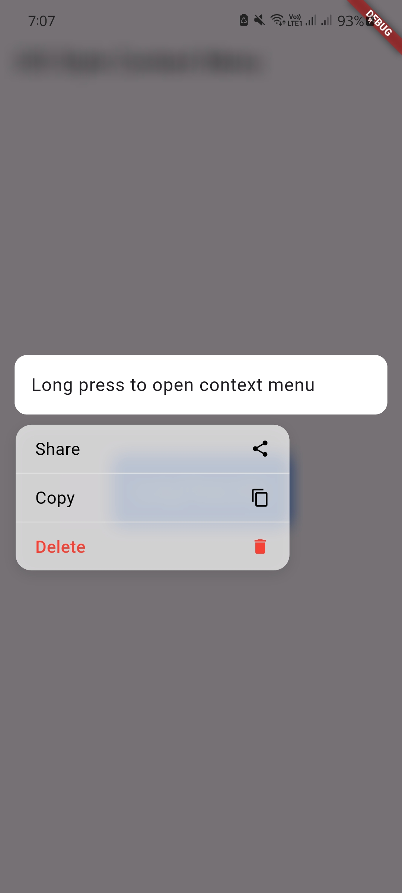

# ios_style_context_menu

A Flutter package that brings an iOS-style context menu to Android. This menu mimics the visual style and interaction behavior of iOS when a user long-presses on a card, image, or any widget.

<p align="center">
  
</p>

## ✨ Features

- iOS-like context menu on Android.
- Smooth and customizable animations.
- Multiple action items (Share, Copy, Delete, etc.).
- Easy to integrate with any widget.
- Optional shadow and blurred background effects.

## 🚀 Getting Started

To start using this package, add it to your `pubspec.yaml`:

```yaml
dependencies:
  ios_style_context_menu: ^0.0.1
